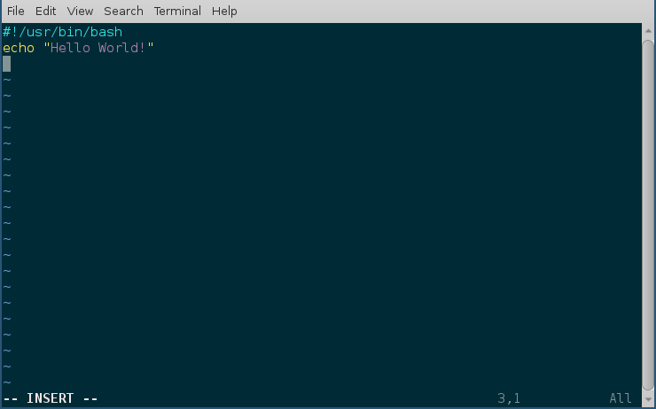

File permissions
=================

.. index:: File permission

Linux follows long Unix history, and has the same kinds of permission and
ownership of files and directories. In this chapter, we will learn in detail
about the same.

Let us look at the output of *ls -l* command.

::

    $ ls -l
    total 24
    drwxrwxr-x. 2 fedora fedora 4096 Jun 24 08:00 dir1
    -rw-rw-r--. 1 fedora fedora  174 Jun 23 13:26 files.tar.bz2
    -rw-rw-r--. 1 fedora fedora  164 Jun 23 13:20 files.tar.gz
    -rw-rw-r--. 1 fedora fedora   19 Jun 23 14:14 hello.txt
    lrwxrwxrwx. 1 fedora fedora   13 Jun 23 12:32 name -> /etc/hostname

The first column contains the permission details of each file and directory. The
permissions are displayed using groups of three values, *r*  for read access,
*w* for write access, and *x* for execute access. These 3 values are mentioned
for owner, group, and other user accounts. The first - can be *d* for
directories or *l* for links.

There’s another way to calculate the same file permissions, using numbers.

+----------+-----+
| Read     | 4   |
+----------+-----+
| Write    | 2   |
+----------+-----+
| Execute  | 1   |
+----------+-----+

This means, if you want to give read and write access only to the owner and
group, you mention it like this "660", where the first digit is for the owner,
second digit is for the group, and the third digit is for the other users. We
can use this format along with the *chmod* command to change permissions of any
file or directory.

.. index:: chmod

chmod command
--------------

*chmod* is the command which changes the file mode bits. Through chmod command
one can alter the access permissions (i.e to permissions to read, write and
execute) to file system objects (i.e files and directories). If we look at the
command closely chmod is the abbreviation of change mode. A few examples are
given below.

::

    $ echo "hello" > myfile.txt
    $ cat myfile.txt
    hello
    $ ls -l myfile.txt
    -rw-rw-r--. 1 fedora fedora 6 Jun 25 03:42 myfile.txt
    $ chmod 000 myfile.txt
    $ ls -l myfile.txt
    ----------. 1 fedora fedora 6 Jun 25 03:42 myfile.txt
    $ cat myfile.txt 
    cat: myfile.txt: Permission denied
    $ chmod 600 myfile.txt
    $ ls -l myfile.txt
    -rw-------. 1 fedora fedora 6 Jun 25 03:42 myfile.txt
    $ cat myfile.txt
    hello

In the first line, we created a new file called *myfile.txt* using the *echo*
command (we redirected the output of echo into the file). Using the *chmod
000 myfile.txt* command, we removed the read/write permissions of the file, and
as you can see in the next line, even the owner of the file cannot read it.
Setting the mode to *600* brings back read/write capability to the owner of that
particular file.

The executable permission bit is required for directory access, and also for any
file you want to execute.

.. index:: PATH

PATH variable
--------------

The PATH is a shell variable. 
When we type a command in the bash shell, it searches for the command in the directories 
mentioned in the succeeding/sequential order, in the PATH variable. We can see the current
 PATH value using the echo command.

::

    $ echo $PATH
    /usr/local/bin:/usr/bin:/usr/local/sbin:/usr/sbin:/home/fedora/.local/bin:/home/fedora/bin

The different directories are separated by `:`. To a search a particular command the shell will search in the following sequential order -

- `/usr/local/bin`
- `/usr/bin`
- `/usr/local/sbin`
- `/usr/sbin`
- `/home/fedora/.local/bin`
- `/home/fedora/bin`

You can see the /home/fedora/bin directory is mentioned in the path. This means if we have that directory, and an executable file is in there, we can use it as a normal command in our shell. We will see an example of this, later in the book.

.. index:: bash_profile

~/.bash_profile file
----------------------

`~/.bash_profile` is the configuration file for bash for the users who are allowed to login (via GUI or via ssh).
On Fedora systems this file also read configuration from the `~/.bashrc` file.

::

    # Get the aliases and functions
    if [ -f ~/.bashrc ]; then
        . ~/.bashrc
    fi

One can set environment variables, update **$PATH** or any other important
variables, or commands to execute after login using this file. But, remember to
relogin or source the file (`source ~/.bash_profile`) after making the change.

.. index:: bashrc

.bashrc file 
------------

The *~/.bashrc* is a special configuration file for your bash terminal used for
the users who can not login via the standard methods. These accounts will have
*nologin* marked in the `/etc/passwd` file. For example:

::

    mail:x:8:12:mail:/var/spool/mail:/sbin/nologin
    operator:x:11:0:operator:/root:/sbin/nologin
    games:x:12:100:games:/usr/games:/sbin/nologin
    ftp:x:14:50:FTP User:/var/ftp:/sbin/nologin

You can define or delete or update environment variables and add commands to
execute when a new interactive shell opens up for the users who can not login.

For example, if want to add a new directory path to the **PATH** variable, then
we can add the following line at the end of the *~/.bashrc* file.

::

    export PATH=/mnt/myproject/bin:$PATH

After modifying the `.bashrc` file you will have to source it, or open a new tab in your terminal
to see the change.

.. important:: To know more, read the man page of *bash* command.

.. index:: which

which command
--------------

We use the *which* command, to find the exact path of the executable being used
by a command in our shell.

::

    $ which chmod
    /usr/bin/chmod
    $ which tree
    /usr/bin/which: no tree in (/usr/local/bin:/usr/bin:/usr/local/sbin:/usr/sbin:/home/fedora/.local/bin:/home/fedora/bin)

The second example shows the output in case the *which* command cannot find the
executable mentioned.

.. index:: Use *which* command to see how $PATH variable works

Use *which* command to see how $PATH variable works
----------------------------------------------------

::

    $ asakj
    bash: asakj: command not found...

    $ which asakj
    /usr/bin/which: no asakj in (/home/adas/.local/bin:/home/adas/bin:/home/adas/.cargo/bin:/usr/local/bin:/usr/local/sbin:/usr/bin:/usr/sbin)

There is no command as *asakj*. The shell searched for *asakj* in the directory as designated under the $PATH varible in the .bashrc file and not found it - `bash: asakj: command not found...`
Then with the *which* command we can actually see how does that search work.

she-bang or sha-bang in executable files
-----------------------------------------

she-bang or sha-bang is the first line in scripts; which starts with *#!* and
then the path of the interpreter to be used for the rest of the file. We will
create a simple bash hello world script using the same, and then execute it.

::

    $ vim hello.sh
    $ chmod +x hello.sh
    $ ./hello.sh
    Hello World!
