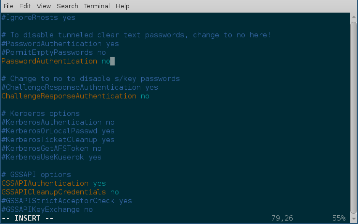

Networking commands
====================

In this chapter, we will learn about a few basic networking commands, which will help us in our daily Linux usage.

.. index:: ip

Finding the IP address
-----------------------

The *ip* command can be used to find the IP address of the system.

::

    $ ip addr show
    1: lo: <LOOPBACK,UP,LOWER_UP> mtu 65536 qdisc noqueue state UNKNOWN group default qlen 1
        link/loopback 00:00:00:00:00:00 brd 00:00:00:00:00:00
        inet 127.0.0.1/8 scope host lo
        valid_lft forever preferred_lft forever
        inet6 ::1/128 scope host 
        valid_lft forever preferred_lft forever
    2: eth0: <BROADCAST,MULTICAST,UP,LOWER_UP> mtu 1454 qdisc fq_codel state UP group default qlen 1000
        link/ether fa:16:3e:3c:ed:27 brd ff:ff:ff:ff:ff:ff
        inet 172.10.95.253/20 brd 172.10.111.255 scope global dynamic eth0
        valid_lft 57021sec preferred_lft 57021sec
        inet6 fe80::f816:3eff:fe3c:ed27/64 scope link 
        valid_lft forever preferred_lft forever

Here *lo* is a special device which points to the same system (also known as *localhost*). The IP *127.0.0.1* always points to the the *localhost*.   
*eth0* is our ethernet device which connects to the network.

.. index:: ping

ping command
-------------

*ping* is simple way to find if you are connected to Internet or not.   
We can also ping any particular computer to find if the computer is connected to the network or not. Press *Ctrl+c* to stop the loop.

    $ ping google.com
    PING google.com (216.58.201.142) 56(84) bytes of data.
    64 bytes from mad06s25-in-f142.1e100.net (216.58.201.142): icmp_seq=1 ttl=44 time=157 ms
    64 bytes from mad06s25-in-f142.1e100.net (216.58.201.142): icmp_seq=2 ttl=44 time=156 ms
    64 bytes from mad06s25-in-f142.1e100.net (216.58.201.142): icmp_seq=3 ttl=44 time=156 ms
    ^C
    --- google.com ping statistics ---
    3 packets transmitted, 3 received, 0% packet loss, time 2000ms
    rtt min/avg/max/mdev = 156.373/156.811/157.566/0.704 ms

.. index:: dns

Short note about DNS
---------------------

DNS or Domain Name System is a decentralized naming system for systems which are
connected to Internet (can be for private networks too). This is the way a
computer knows, which other computer to connect to, when we type google.com in
our browser, or in the ping command. There are servers known as dns servers, and
for every domain name it needs to find, the client system generally connects to
these dns servers, and finds out the IP address of the computer at that domain
name.

/etc/hosts
-----------

The system looks at this file first for any name resolution. If it can not find the DNS
entry, then the system looks at the */etc/resolv.conf*, and connects to the DNS server.

You can update */etc/hosts* file to add a domain to any particular IP address. Say, you want
to be able to reach a server at IP address `x.x.x.x` with the name `datastore`, so you add an
entry like the following to the file.

::

    x.x.x.x    datastore

/etc/resolv.conf
-----------------

*/etc/resolv.conf* is the configuration file whcih contains the DNS server address to use for DNS queries.

::

    $ cat /etc/resolv.conf 
    # Generated by NetworkManager
    nameserver 1.1.1.1
    nameserver 8.8.8.8

Here you can see that `1.1.1.1` & `8.8.8.8` are two DNS servers are being in
this machine. The *1.1.1.1* is the DNS server from Cloudflare, and *8.8.8.8* is
the DNS server hosted by Google.

.. index:: systemd-resolved

systemd-resolved controlled name resolution
--------------------------------------------

In most of the modern systems you will find the `/etc/resolv.conf` looks a bit different and actually a symbolic link.
The example below is from `Ubuntu 20.04`.

::

    $ ls -l /etc/resolv.conf
    lrwxrwxrwx 1 root root 39 Jul 31  2020 /etc/resolv.conf -> ../run/systemd/resolve/stub-resolv.conf

    $ cat /etc/resolv.conf
    # This file is managed by man:systemd-resolved(8). Do not edit.
    #
    # This is a dynamic resolv.conf file for connecting local clients to the
    # internal DNS stub resolver of systemd-resolved. This file lists all
    # configured search domains.
    #
    # Run "resolvectl status" to see details about the uplink DNS servers
    # currently in use.
    #
    # Third party programs must not access this file directly, but only through the
    # symlink at /etc/resolv.conf. To manage man:resolv.conf(5) in a different way,
    # replace this symlink by a static file or a different symlink.
    #
    # See man:systemd-resolved.service(8) for details about the supported modes of
    # operation for /etc/resolv.conf.

    nameserver 127.0.0.53
    options edns0 trust-ad
    search localdomain

That strange IP address, **127.0.0.53** is a special one managed by
**systemd-resolved** service, where it listens for DNS queries. By default it picks up the DNS server addresses provided by the `DHCP` service, in case
you want to manually set that up, you can configure them at the `/etc/systemd/resolved.conf` file.
Here we are setting `1.1.1.1` as the primary DNS server, `8.8.8.8` as the fallback server, and also enabling `DNS over TLS`.

::

    #  This file is part of systemd.
    #
    #  systemd is free software; you can redistribute it and/or modify it
    #  under the terms of the GNU Lesser General Public License as published by
    #  the Free Software Foundation; either version 2.1 of the License, or
    #  (at your option) any later version.
    #
    # Entries in this file show the compile time defaults.
    # You can change settings by editing this file.
    # Defaults can be restored by simply deleting this file.
    #
    # See resolved.conf(5) for details

    [Resolve]
    DNS= 1.1.1.1
    FallbackDNS= 8.8.8.8
    #Domains=
    #LLMNR=no
    #MulticastDNS=no
    #DNSSEC=no
    DNSOverTLS=yes
    #Cache=no-negative
    #DNSStubListener=yes
    #ReadEtcHosts=yes

You can learn about all the settings from the man page, `man resolved.conf`.

If want to go back to the simple `/etc/resolv.conf` file, you can remove the
symlink and put in a new file at `/etc/resolv.conf`.

.. index:: resolvectl

resolvectl command
-------------------

The `resolvectl` command helps us to query via the `systemd-resolved` service.
To check the current settings, use the `status` flag.

::

    $ resolvectl status
    Global
           LLMNR setting: no                  
    MulticastDNS setting: no                  
      DNSOverTLS setting: yes                 
          DNSSEC setting: no                  
        DNSSEC supported: no                  
             DNS Servers: 1.1.1.1             
    Fallback DNS Servers: 8.8.8.8             
              DNSSEC NTA: 10.in-addr.arpa     
                          16.172.in-addr.arpa 
                          168.192.in-addr.arpa
                          17.172.in-addr.arpa 
                          18.172.in-addr.arpa 
                          19.172.in-addr.arpa 
                          20.172.in-addr.arpa 
                          21.172.in-addr.arpa 
                          22.172.in-addr.arpa 
                          23.172.in-addr.arpa 
                          24.172.in-addr.arpa 
                          25.172.in-addr.arpa 
                          26.172.in-addr.arpa 
                          27.172.in-addr.arpa 
                          28.172.in-addr.arpa 
                          29.172.in-addr.arpa 
                          30.172.in-addr.arpa 
                          31.172.in-addr.arpa 
                          corp                
                          d.f.ip6.arpa        
                          home                
                          internal            
                          intranet            
                          lan                 
                          local               
                          private             
                          test                

    Link 2 (ens33)
          Current Scopes: DNS          
    DefaultRoute setting: yes          
           LLMNR setting: yes          
    MulticastDNS setting: no           
      DNSOverTLS setting: yes          
          DNSSEC setting: no           
        DNSSEC supported: no           
             DNS Servers: 192.168.195.1
              DNS Domain: ~.           
                          localdomain

To query the IP address of a domain:

::

    resolvectl query fedoraproject.org
    fedoraproject.org: 140.211.169.196             -- link: ens33
                       140.211.169.206             -- link: ens33
                       152.19.134.198              -- link: ens33
                       38.145.60.21                -- link: ens33
                       8.43.85.67                  -- link: ens33
                       152.19.134.142              -- link: ens33
                       209.132.190.2               -- link: ens33
                       38.145.60.20                -- link: ens33
                       67.219.144.68               -- link: ens33
                       8.43.85.73                  -- link: ens33

    -- Information acquired via protocol DNS in 1.4ms.
    -- Data is authenticated: no

To view the `TXT` record:

::

    $ resolvectl query -t TXT fedoraproject.org
    fedoraproject.org IN TXT "v=spf1 a a:mailers.fedoraproject.org ip4:38.145.60.11 ip4:38.145.60.12 ?all" -- link: ens33

    -- Information acquired via protocol DNS in 289.7ms.
    -- Data is authenticated: no

`resolvectl` command can do many more things. Please have a look at the man page for more examples.

.. index:: host

host command
-------------

The **host** command is a simple DNS lookup utility. It will show you the IP
address of any given hostname.

::

    $ host www.example.com
    www.example.com has address 93.184.216.34
    www.example.com has IPv6 address 2606:2800:220:1:248:1893:25c8:1946

.. index:: dig

dig command
------------

**dig** command can tell us DNS records, MX details (used to send emails) and other information for a given domain name.

::

    $ dig kushaldas.in

    ; <<>> DiG 9.10.4-P8-RedHat-9.10.4-5.P8.fc25 <<>> kushaldas.in
    ;; global options: +cmd
    ;; Got answer:
    ;; ->>HEADER<<- opcode: QUERY, status: NOERROR, id: 50750
    ;; flags: qr rd ra; QUERY: 1, ANSWER: 1, AUTHORITY: 0, ADDITIONAL: 1

    ;; OPT PSEUDOSECTION:
    ; EDNS: version: 0, flags:; udp: 512
    ;; QUESTION SECTION:
    ;kushaldas.in.			IN	A

    ;; ANSWER SECTION:
    kushaldas.in.		5528	IN	A	208.113.152.208

    ;; Query time: 66 msec
    ;; SERVER: 8.8.8.8#53(8.8.8.8)
    ;; WHEN: Sun Jun 25 11:37:00 IST 2017
    ;; MSG SIZE  rcvd: 57

If you want to print only the IP address in the output, you can use *+short* as
argument.

::

    $ dig +short kushaldas.in
    208.113.152.208

You can also specify any particular type of record from the DNS server.
For example, if I want to get the `TXT` records, I can do the following command.

::

    $ dig +short kushaldas.in TXT
    "google-site-verification=DPpUk-OfBLT-5PkbSR9VM2Uht3eXaksthROvS-L9iKY"
    "kolab-verify=35f0040cd1ebb20fb7f0b3fade0e1c8e"

You can use any of the following options instead of `TXT`: *A|MX|TXT|CNAME|NS*.

If you want to specify a DNS server to use, you can do that with the address
specified at the end of the command along with a @ sign.

::

    $ dig rtnpro.com @208.67.222.222

    ; <<>> DiG 9.10.4-P8-RedHat-9.10.4-5.P8.fc25 <<>> rtnpro.com @208.67.222.222
    ;; global options: +cmd
    ;; Got answer:
    ;; ->>HEADER<<- opcode: QUERY, status: NOERROR, id: 27312
    ;; flags: qr rd ra; QUERY: 1, ANSWER: 0, AUTHORITY: 1, ADDITIONAL: 1

    ;; OPT PSEUDOSECTION:
    ; EDNS: version: 0, flags:; udp: 4096
    ;; QUESTION SECTION:
    ;rtnpro.com.			IN	A

    ;; AUTHORITY SECTION:
    rtnpro.com.		3600	IN	SOA	dns1.bigrock.in. rtnpro.gmail.com. 2017021401 7200 7200 172800 38400

    ;; Query time: 899 msec
    ;; SERVER: 208.67.222.222#53(208.67.222.222)
    ;; WHEN: Sun Jun 25 11:40:01 IST 2017
    ;; MSG SIZE  rcvd: 106

If you want learn about the full path of the DNS query, you can find that out
by *+trace* flag. For the following example where we are trying to find the IP
address for `anweshadas.in <https://anweshadas.in>`_, `dig` first connects to
the root name servers to find the correct DNS resolvers for the *.in* servers,
then they tells they tell *dig* to go the servers (in this case Dreamhost name
servers) which contain the exact IP address for the domain.

::

    $ dig +trace anweshadas.in @8.8.8.8

    ; <<>> DiG 9.11.5-P4-5.1+deb10u5-Debian <<>> +trace anweshadas.in @8.8.8.8
    ;; global options: +cmd
    .			47041	IN	NS	m.root-servers.net.
    .			47041	IN	NS	b.root-servers.net.
    .			47041	IN	NS	c.root-servers.net.
    .			47041	IN	NS	d.root-servers.net.
    .			47041	IN	NS	e.root-servers.net.
    .			47041	IN	NS	f.root-servers.net.
    .			47041	IN	NS	g.root-servers.net.
    .			47041	IN	NS	h.root-servers.net.
    .			47041	IN	NS	a.root-servers.net.
    .			47041	IN	NS	i.root-servers.net.
    .			47041	IN	NS	j.root-servers.net.
    .			47041	IN	NS	k.root-servers.net.
    .			47041	IN	NS	l.root-servers.net.
    .			47041	IN	RRSIG	NS 8 0 518400 20210730050000 20210717040000 26838 . MFT2Q71k1LZVfXyH2qKWLoS7a7j5aSVdlp4SrIptZXP0ydjav7y5sLv/ Yz76Ki+3PU0G3SagwbC61bdi6sNV5DiBpxIzny8Mavx23P6XKsbetFr1 RgkwlzyGJmd0kLA4ydgjrzRh2hhvQkBDWtzBpVLUo7tDmwodE/zi/RUA CMofG9YIkgxSX0/5qUUKXhijHocYXQU++x7RbFqTxJBEW8Fn6GDTtg1Z pTT0UYpmMX5NHiRlneYb6ChHGQLfbQ1kBblxuQlsPb46dJBKaXT3wr3/ SXUXQCZ+ADCsolK+LhGeQtByqBEXryjuT/U2WK8mqcTAs/d1bToRwrH5 nxizXg==
    ;; Received 525 bytes from 8.8.8.8#53(8.8.8.8) in 1 ms

    in.			172800	IN	NS	ns1.registry.in.
    in.			172800	IN	NS	ns2.registry.in.
    in.			172800	IN	NS	ns3.registry.in.
    in.			172800	IN	NS	ns4.registry.in.
    in.			172800	IN	NS	ns5.registry.in.
    in.			172800	IN	NS	ns6.registry.in.
    in.			86400	IN	DS	54739 8 1 2B5CA455A0E65769FF9DF9E75EC40EE1EC1CDCA9
    in.			86400	IN	DS	54739 8 2 9F122CFD6604AE6DEDA0FE09F27BE340A318F06AFAC11714A73409D4 3136472C
    in.			86400	IN	RRSIG	DS 8 1 86400 20210730170000 20210717160000 26838 . i6toEqveLqwB/W4Z/77bfGyFyYJRepGi8uYoQ0jEZM1I95qxsqeMCtdV cr3foafFJKaCkvH2eAfIUrHH8GMn/t9lVDrHwikLisoaPaSahgoQAOPm ClR/VDcAxkVwE+07Ir6ROt+qXn5jse4gnB+nezI4Q+rakearp8D9AaxJ ubWnAMfHOqKBLDMGNrm6/XRk6HA43nrMIUKNCFbhpKo5gkvy+S768uQu ySRdLTUxN0ELO9Qv7fBqQxamRyZ1N5LKTpjkKNKYwnihOVIWvktqt4p7 xoJL56z0XE9HhhI807GOBcpLBeaRKZXOA8GKU77pm9lDLHSuG4epF3zD X9Vayw==
    ;; Received 794 bytes from 193.0.14.129#53(k.root-servers.net) in 1 ms

    anweshadas.in.		86400	IN	NS	ns3.dreamhost.com.
    anweshadas.in.		86400	IN	NS	ns2.dreamhost.com.
    anweshadas.in.		86400	IN	NS	ns1.dreamhost.com.
    bo801o0uciino3vfr38lrljcrv2ucohi.in. 1800 IN NSEC3 1 1 1 00763C64 BO9UQ54VB22M3J37NR3N6GRC6J4RVUTV NS SOA RRSIG DNSKEY NSEC3PARAM
    bo801o0uciino3vfr38lrljcrv2ucohi.in. 1800 IN RRSIG NSEC3 8 2 1800 20210813034112 20210714030559 65169 in. gZ3NODrbaP6/GV1McvgHTD4wn9w2w5CCqjoI+JyjRpNVweGuDex5A/ls OznLptg/nmmJlx3835suy9I79h0tOjDjWNXxLQ9scKCtYZJSFqIdnRS9 QP5egjVJnZ3zOLN0lO//hQa/gIhKCSqYpLCWLS1RoFn3B5uvF96VopKU YYfjXFbqYCjyx4T8oZi72xFUChr/yi/dVkHbM0OvwLCJRg==
    8679tah9aq7s760bquasj6clf332vb3e.in. 1800 IN NSEC3 1 1 1 00763C64 869E0HEFFMPE89PM1VHLGQHH72K7IGRM NS DS RRSIG
    8679tah9aq7s760bquasj6clf332vb3e.in. 1800 IN RRSIG NSEC3 8 2 1800 20210815211611 20210716202452 65169 in. GahrJsYIVpR5+eaykB/DuaIPSUeR+rX3DxR7yR3mMN/7pVSekbZ/Fw4I q5NZLKhBp2WKq0aiwxYX4+VfKjdLyQLKeGoXYeFpwps6KiCf8gLjDJwO Hx1PCgg5CnUEYw+iXd3GGx46ZlyHHbuSNa4YbVBEHevcmo/3oc3ubiMf VKTcuR+upzBQmLzNId6LB9qZBpFfe6GPCy/sMMaCKB0OwQ==
    ;; Received 664 bytes from 37.209.196.12#53(ns3.registry.in) in 2 ms

    anweshadas.in.		14400	IN	A	159.89.209.77
    ;; Received 58 bytes from 162.159.26.14#53(ns1.dreamhost.com) in 160 ms

.. index:: ss

ss command
-----------

**ss** command shows us socket statistics from the system. This command replaces the older netstat command.   
Read the man page of the command to know more about the different arguments we can pass at the command line.

::

    $ ss -putn
    Netid State      Recv-Q Send-Q                           Local Address:Port                                          Peer Address:Port              
    tcp   ESTAB      0      0                                 192.168.1.101:51496                                       162.125.34.129:443                 users:(("dropbox",pid=28797,fd=80))
    tcp   ESTAB      0      0                                 192.168.1.101:47864                                       74.125.200.189:443                 users:(("chrome",pid=22112,fd=385))
    tcp   ESTAB      0      0                                 192.168.1.101:59524                                      209.12.123.55:22                  users:(("ssh",pid=26621,fd=3))
    ... long output

You can also learn various other statistics about sockets, for example, if you
want to know all the sockets from your computer connected to any machine at
port *443*, you can use the following command.

::

    $ ss -pt dst :443

.. index:: traceroute

traceroute command
-------------------

The **traceroute** command is used to show the full route of a network packet from the system to any given host.

::

    $ traceroute www.rtnpro.com
    traceroute to www.rtnpro.com (146.185.181.157), 30 hops max, 60 byte packets
    1  gateway (192.168.1.1)  1.434 ms  1.920 ms  1.891 ms
    2  45.113.248.3 (45.113.248.3)  7.478 ms  10.335 ms  10.343 ms
    3  45.113.248.1 (45.113.248.1)  10.319 ms  10.293 ms  10.274 ms
    4  121.244.26.1.static-pune.vsnl.net.in (121.244.26.1)  26.938 ms  26.608 ms  27.165 ms
    5  172.31.183.162 (172.31.183.162)  9.883 ms  10.133 ms  10.122 ms
    6  172.31.19.201 (172.31.19.201)  10.591 ms 172.29.250.33 (172.29.250.33)  6.894 ms 172.31.19.201 (172.31.19.201)  8.203 ms
    7  ix-ae-0-4.tcore1.MLV-Mumbai.as6453.net (180.87.38.5)  9.378 ms  8.886 ms  9.240 ms
    8  if-ae-9-5.tcore1.WYN-Marseille.as6453.net (80.231.217.77)  159.550 ms if-ae-5-2.tcore1.WYN-Marseille.as6453.net (180.87.38.126)  159.614 ms if-ae-9-5.tcore1.WYN-Marseille.as6453.net (80.231.217.77)  159.506 ms
    9  if-ae-8-1600.tcore1.PYE-Paris.as6453.net (80.231.217.6)  159.392 ms  159.474 ms  159.405 ms
    10  if-ae-15-2.tcore1.AV2-Amsterdam.as6453.net (195.219.194.145)  159.327 ms  158.355 ms  122.520 ms
    11  195.219.194.26 (195.219.194.26)  133.216 ms  134.168 ms  134.683 ms
    12  138.197.250.29 (138.197.250.29)  192.236 ms  192.125 ms 138.197.250.23 (138.197.250.23)  192.083 ms
    13  * 146.185.181.157 (146.185.181.157)  191.831 ms  191.861 ms

.. index:: tracepath

tracepath command
------------------

The **tracepath** command traces a path to a network host discovering MTU along the path. This is a modern replacement of the *traceroute* command, and also does not need superuser privileges to execute.

::

    $ tracepath www.rtnpro.com
    1?: [LOCALHOST]                      pmtu 1500
    1:  gateway                                               0.950ms 
    1:  gateway                                               0.715ms 
    2:  gateway                                               0.689ms pmtu 1492
    2:  45.113.248.3                                          3.564ms 
    3:  45.113.248.1                                          4.639ms 
    4:  121.244.26.1.static-pune.vsnl.net.in                  4.132ms 
    5:  172.31.183.162                                        4.733ms asymm  7 
    6:  172.29.250.33                                        12.524ms asymm  7 
    7:  ix-ae-0-4.tcore1.MLV-Mumbai.as6453.net                7.208ms asymm  8 
    8:  if-ae-5-2.tcore1.WYN-Marseille.as6453.net           125.727ms asymm 12 
    9:  if-ae-8-1600.tcore1.PYE-Paris.as6453.net            128.893ms asymm 11 
    10:  if-ae-15-2.tcore1.AV2-Amsterdam.as6453.net          126.019ms asymm  9 
    11:  195.219.194.26                                      136.373ms asymm 10 
    12:  138.197.250.27                                      130.198ms 
    13:  146.185.181.157                                     131.040ms reached
        Resume: pmtu 1492 hops 13 back 13 

.. index:: ssh

Remote login to a computer using ssh tool
-----------------------------------------

We use the **ssh** command to login to remote computers. The remote computer must
have the **sshd** service running, and should also allow clients to connect to
this service. Let’s try to connect to localhost itself. Remember to start the
**sshd** service before this step.

::

    $ ssh kdas@localhost
    kdas@localhost's password: 
    Last login: Wed Jun 21 08:44:40 2017 from 192.168.1.101
    $

As you can see, the command syntax is ssh followed by user@hostname. If your
remote system's user name is same as your current one, then you can omit the
username and just use the hostname(IP address or domain name).

::

    $ ssh localhost
    kdas@localhost's password: 
    $

ssh key generation
-------------------

ssh keys are used in the daily life of a Linux user or developer. In simple
terms, it helps us to securely login to other computers. In the following
example, we will create a new key for our user. 

::

    $ ssh-keygen -t rsa -b 4096 -C "kushaldas@gmail.com"
    Generating public/private rsa key pair.
    Enter file in which to save the key (/home/fedora/.ssh/id_rsa): 
    Enter passphrase (empty for no passphrase): 
    Enter same passphrase again: 
    Your identification has been saved in /home/fedora/.ssh/id_rsa.
    Your public key has been saved in /home/fedora/.ssh/id_rsa.pub.
    The key fingerprint is:
    SHA256:O6Rxir7lpFBQsBnvs+NJRU8Ih01ffVBvLTE8s5TpxLQ kushaldas@gmail.com
    The key's randomart image is:
    +---[RSA 4096]----+
    |  o.o+o   ...*=o |
    |   *.o.o .  . @=.|
    |  + . o o    =E++|
    |   o . o      oo |
    |    + o S        |
    |   . = * .       |
    |  . = = o        |
    |   = B   .       |
    |    *..          |
    +----[SHA256]-----+

As you can see in the output, the key has been saved in the *~/.ssh* directory.
You can also find out that these files are only readable by the owner.

::

    $ ls -l .ssh
    total 12
    -rw-------. 1 fedora fedora 3326 Jun 25 06:25 id_rsa
    -rw-r--r--. 1 fedora fedora  745 Jun 25 06:25 id_rsa.pub

Each key has two parts. The *id_rsa.pub* is the public key and *id_rsa* is the
private part of the key. One can safely upload or use the public key anywhere.
But the private key, should be kept in a safe manner, because if people get
access to your private key, they can also access all of your information from
any system using that key.

In other words, do not give the private key to anyone, or do not randomly copy
the *.ssh* directory to a USB drive and then forget about it.

.. index:: ssh-copy-id

ssh-copy-id
------------

**ssh-copy-id** command copies the keys to a given remote system. After
this step we can use the ssh key to login to the box directly, instead of the
usual username / password method.

::

    $ ssh-copy-id fedora@209.12.123.55
    /usr/bin/ssh-copy-id: INFO: attempting to log in with the new key(s), to filter out any that are already installed
    /usr/bin/ssh-copy-id: INFO: 2 key(s) remain to be installed -- if you are prompted now it is to install the new keys

    fedora@209.12.123.55's password:

    Number of key(s) added: 2

    Now try logging into the machine, with:   "ssh 'fedora@209.12.123.55'"
    and check to make sure that only the key(s) you wanted were added.

Stop and disable the sshd service
----------------------------------

If you don't need ssh access to your computer (say, your laptop), you should
always stop and disable the *sshd* service in the computer.

Disable password based login for ssh
-------------------------------------

Remember, this step can be **dangerous**.  
Unless you’re really, really sure that you can access a computer by either
logging in physically or using your ssh key (and you have a backup of the key
somewhere), you should not do this step.

By disabling password based login in the sshd service, you make sure that only
people with the right private key can login to the computer. This helps greatly
when people try to break into the system by guessing the password. This is also
really helpful in case your computer is connected to some network, and you still
need to access it over ssh.

We will use vim to open the */etc/ssh/sshd_config* file, which is the
configuration file for *sshd* service.

::

    $ sudo vim /etc/ssh/sshd_config

Search for the term *PasswordAuthentication*, and change the value to no. Below
I have added a new line to do the same. You can also understand, that the lines
starting with *#* are comments in this configuration file. This configuration
will disable password based authentication for the sshd service. You should
remember to restart the sshd service after this step for the change to take
place.

How to find active (open) network connections from your computer?
-----------------------------------------------------------------

::

    $ sudo lsof -i -n -P

The *lsof* command shows open files, using *-i* we are asking to list of all
Internet and x.25 (HP-UX) network files. To know more, read the man page of the
*lsof* command.

