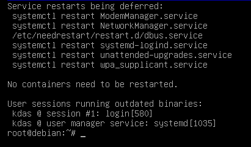
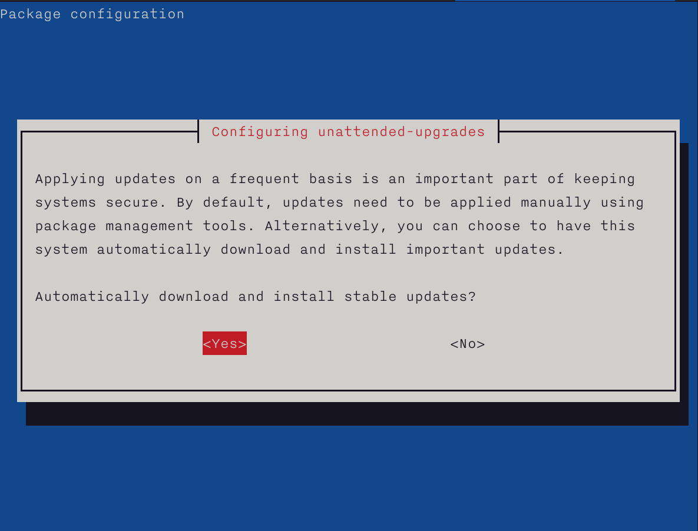

Package management
==================

In the Free and Open Source Software world, most software is released in source
code format by developers. This means that generally, if you want to install a
piece of software, you will find the source code on the website of the project.
As a user, you will have to find and install all the other bits of software,
that this particular piece depends on (the *dependencies*) and then install the
software. To solve this *painful* issue, all Linux distributions have something
called a *package management system*. Volunteers (mostly) all across the world
help make binary software packages out of source code released by the
developers, in such a way that users of the Linux distribution can easily
install, update or remove that software.

It’s generally recommended, we use the package management system that comes with
the distribution, to install software for the users. If you are really sure
about what you’re doing in the system, you can install from the source files
too; but that can be dangerous.

.. index:: dnf

dnf command
-------------

**dnf** is the package management system in Fedora. The actual packages come in
the *rpm* format. *dnf* helps you search, install or uninstall any package from
the Fedora package repositories. You can also use the same command to update
packages in your system.

Searching for a package
------------------------

::

  $ dnf search pss
  Fedora 25 - x86_64                                                        34 MB/s |  50 MB     00:01    
  Fedora 25 - x86_64 - Updates                                              41 MB/s |  23 MB     00:00    
  Last metadata expiration check: 0:00:07 ago on Sun Jun 25 04:14:22 2017.
  =========================================== N/S Matched: pss ============================================
  pss.noarch : A power-tool for searching inside source code files
  pssh.noarch : Parallel SSH tools

First the tool, downloads all the latest package information from the
repository, and then gives us the result.

Finding more information about a package
-----------------------------------------

*dnf info* gives us more information about any given package.

::

  $ dnf info pss
  Last metadata expiration check: 0:04:59 ago on Sun Jun 25 04:14:22 2017.
  Available Packages
  Name        : pss
  Arch        : noarch
  Epoch       : 0
  Version     : 1.40
  Release     : 6.fc25
  Size        : 58 k
  Repo        : fedora
  Summary     : A power-tool for searching inside source code files
  URL         : https://github.com/eliben/pss
  License     : Public Domain
  Description : pss is a power-tool for searching inside source code files.
              : pss searches recursively within a directory tree, knows which
              : extensions and file names to search and which to ignore, automatically
              : skips directories you wouldn't want to search in (for example .svn or .git),
              : colors its output in a helpful way, and does much more.

.. index:: dnf install

Installing a package
---------------------

The *dnf install* command helps us install any given package. We can pass more
than one package name as the argument.

::

  $ sudo dnf install pss wget
  Last metadata expiration check: 0:37:13 ago on Sun Jun 25 03:44:07 2017.
  Package wget-1.18-3.fc25.x86_64 is already installed, skipping.
  Dependencies resolved.
  =====================================================================================================================================================
  Package                         Arch                               Version                                 Repository                          Size
  =====================================================================================================================================================
  Installing:
  pss                             noarch                             1.40-6.fc25                             fedora                              58 k

  Transaction Summary
  =====================================================================================================================================================
  Install  1 Package

  Total download size: 58 k
  Installed size: 196 k
  Is this ok [y/N]: y
  Downloading Packages:
  pss-1.40-6.fc25.noarch.rpm                                                                                           969 kB/s |  58 kB     00:00    
  -----------------------------------------------------------------------------------------------------------------------------------------------------
  Total                                                                                                                118 kB/s |  58 kB     00:00     
  Running transaction check
  Transaction check succeeded.
  Running transaction test
  Transaction test succeeded.
  Running transaction
    Installing  : pss-1.40-6.fc25.noarch                                                                                                           1/1 
    Verifying   : pss-1.40-6.fc25.noarch                                                                                                           1/1 

  Installed:
    pss.noarch 1.40-6.fc25                                                                                                                             

  Complete!

To list the available updates
-----------------------------

The following command shows all the available updates for your system.

::

        # dnf list updates

        Last metadata expiration check: 0:52:28 ago on Fri 09 Apr 2021 08:51:39 PM IST.
        Available Upgrades
        fedora-gpg-keys.noarch               33-4              updates
        fedora-repos.noarch                  33-4              updates
        fedora-repos-modular.noarch          33-4              updates

To list all security updates
-----------------------------

`dnf` can also tell you about all the updates which are marked as security updates.

::

    # dnf updateinfo list --security
    Last metadata expiration check: 2:06:38 ago on Sun 25 Jul 2021 03:44:47 AM UTC.
    FEDORA-2021-83fdddca0f Moderate/Sec.  curl-7.76.1-7.fc34.x86_64
    FEDORA-2021-08cdb4dc34 Important/Sec. dhcp-client-12:4.4.2-11.b1.fc34.x86_64
    FEDORA-2021-08cdb4dc34 Important/Sec. dhcp-common-12:4.4.2-11.b1.fc34.noarch
    FEDORA-2021-e14e86e40e Moderate/Sec.  glibc-2.33-20.fc34.x86_64
    FEDORA-2021-e14e86e40e Moderate/Sec.  glibc-common-2.33-20.fc34.x86_64
    FEDORA-2021-e14e86e40e Moderate/Sec.  glibc-doc-2.33-20.fc34.noarch
    FEDORA-2021-e14e86e40e Moderate/Sec.  glibc-langpack-en-2.33-20.fc34.x86_64
    FEDORA-2021-07dc0b3eb1 Critical/Sec.  kernel-core-5.13.4-200.fc34.x86_64
    FEDORA-2021-8b25e4642f Low/Sec.       krb5-libs-1.19.1-14.fc34.x86_64
    FEDORA-2021-83fdddca0f Moderate/Sec.  libcurl-7.76.1-7.fc34.x86_64
    FEDORA-2021-31fdc84207 Moderate/Sec.  libgcrypt-1.9.3-3.fc34.x86_64
    FEDORA-2021-2443b22fa0 Moderate/Sec.  linux-firmware-20210716-121.fc34.noarch
    FEDORA-2021-2443b22fa0 Moderate/Sec.  linux-firmware-whence-20210716-121.fc34.noarch
    FEDORA-2021-d1fc0b9d32 Moderate/Sec.  nettle-3.7.3-1.fc34.x86_64
    FEDORA-2021-0ec5a8a74b Important/Sec. polkit-libs-0.117-3.fc34.1.x86_64
    FEDORA-2021-a6bde7ab18 Moderate/Sec.  python3-urllib3-1.25.10-5.fc34.noarch

Update the packages via dnf
----------------------------

Use **dnf update** command to install all the available updates. You can also
pass the `-y` flag to it.

Find out the services & applications need restart after update in Fedora/CentOS/RHEL
-------------------------------------------------------------------------------------

The **dnf-utils** package contains a special command, **needs-restarting**.
After you do a `dnf update`, when different libraries get updated, there may be
running processes/services which needs restart. One way of doing this is
restarting the system, but that may not be the right choice (may be you are
running critical services) all the time. So, you can find out which ones you
should restart.

Below is the output from a Fedora 34 desktop system.

::

    # needs-restarting 
    1 : /usr/lib/systemd/systemd --system --deserialize 62 
    1616 : /usr/lib/systemd/systemd-resolved 
    1617 : /sbin/auditd 
    1638 : /usr/sbin/ModemManager 
    1639 : avahi-daemon: running [linux-2.local] 
    1640 : /usr/libexec/bluetooth/bluetoothd 
    1641 : /usr/libexec/boltd 
    1642 : /usr/bin/python3 -s /usr/sbin/firewalld --nofork --nopid 
    1643 : /usr/local/bin/ivpn-service 
    1646 : /usr/sbin/mcelog --daemon --foreground 
    1650 : /usr/sbin/rngd -f 
    1651 : /usr/libexec/rtkit-daemon 
    1657 : /usr/libexec/switcheroo-control 
    1659 : /usr/lib/systemd/systemd-machined 
    1662 : /usr/libexec/udisks2/udisksd 
    1664 : /usr/libexec/upowerd 
    1669 : avahi-daemon: chroot helper 
    1688 : /usr/bin/dbus-broker-launch --scope system --audit 
    1695 : /usr/sbin/abrtd -d -s 
    1699 : /usr/sbin/chronyd 
    1723 : /usr/bin/abrt-dump-journal-core -D -T -f -e 
    1724 : /usr/bin/abrt-dump-journal-oops -fxtD 
    1725 : /usr/bin/abrt-dump-journal-xorg -fxtD 
    1728 : /usr/lib/polkit-1/polkitd --no-debug 
    1744 : /usr/libexec/accounts-daemon 
    1745 : /usr/lib/systemd/systemd-logind 
    1776 : /usr/sbin/NetworkManager --no-daemon 
    1788 : /usr/sbin/cupsd -l 
    1877 : /usr/sbin/pcscd --foreground --auto-exit 
    1898 : /usr/sbin/atd -f 
    1899 : /usr/sbin/crond -n 
    1900 : /usr/sbin/gdm 
    1920 : /usr/libexec/uresourced 
    2034 : /usr/sbin/dnsmasq --conf-file=/var/lib/libvirt/dnsmasq/default.conf --leasefile-ro --dhcp-script=/usr/libexec/libvirt_leaseshelper 
    2035 : /usr/sbin/dnsmasq --conf-file=/var/lib/libvirt/dnsmasq/default.conf --leasefile-ro --dhcp-script=/usr/libexec/libvirt_leaseshelper 
    2162 : /usr/sbin/wpa_supplicant -c /etc/wpa_supplicant/wpa_supplicant.conf -u -s 
    2164 : /usr/libexec/packagekitd 
    2393 : /usr/libexec/colord 
    2714 : /usr/sbin/abrt-dbus -t133 
    2730 : gdm-session-worker [pam/gdm-password] 
    2750 : /usr/lib/systemd/systemd --user 
    2756 : (sd-pam) 
    2780 : /usr/libexec/gdm-x-session --run-script /usr/bin/gnome-session 
    2784 : /usr/libexec/Xorg vt2 -displayfd 3 -auth /run/user/1000/gdm/Xauthority -nolisten tcp -background none -noreset -keeptty -novtswitch -verbose 3 
    2838 : /usr/bin/dbus-broker-launch --scope user 
    2843 : /usr/libexec/gnome-session-binary 
    2907 : /usr/libexec/at-spi-bus-launcher 
    2912 : /usr/bin/dbus-broker-launch --config-file=/usr/share/defaults/at-spi2/accessibility.conf --scope user 
    2923 : /usr/libexec/gnome-session-ctl --monitor 
    2924 : /usr/libexec/uresourced --user 
    2926 : /usr/libexec/gnome-session-binary --systemd-service --session=gnome 
    2953 : /usr/bin/gnome-shell 
    2978 : ibus-daemon --panel disable --xim 
    2989 : /usr/libexec/ibus-extension-gtk3 
    3004 : /usr/libexec/ibus-x11 --kill-daemon 
    3015 : /usr/libexec/at-spi2-registryd --use-gnome-session 
    3023 : /usr/libexec/evolution-source-registry 
    3030 : /usr/libexec/goa-daemon 
    3031 : /usr/bin/pipewire 
    3032 : /usr/bin/pipewire-pulse 
    3038 : /usr/bin/pipewire-media-session 
    3044 : /usr/libexec/evolution-calendar-factory 
    3075 : /usr/libexec/gvfs-udisks2-volume-monitor 
    3092 : /usr/libexec/gvfs-mtp-volume-monitor 
    3116 : /usr/libexec/gvfs-gphoto2-volume-monitor 
    3130 : /usr/bin/gjs /usr/share/gnome-shell/org.gnome.Shell.Notifications 
    3147 : /usr/libexec/gsd-color 
    3150 : /usr/libexec/gsd-datetime 
    3153 : /usr/libexec/gsd-keyboard 
    3155 : /usr/libexec/gsd-media-keys 
    3157 : /usr/libexec/gsd-power 
    3160 : /usr/libexec/gsd-print-notifications 
    3161 : /usr/libexec/gsd-rfkill 
    3164 : /usr/libexec/gsd-sharing 
    3169 : /usr/libexec/gsd-sound 
    3175 : /usr/libexec/gsd-wacom 
    3176 : /usr/libexec/gsd-xsettings 
    3213 : /usr/libexec/evolution-data-server/evolution-alarm-notify 
    3219 : /usr/bin/gnome-software --gapplication-service 
    3272 : /usr/bin/abrt-applet --gapplication-service 
    3273 : /usr/bin/gjs /usr/share/gnome-shell/org.gnome.ScreenSaver 
    3366 : /usr/libexec/gsd-printer 
    3524 : /usr/libexec/fwupd/fwupd 
    3611 : /usr/bin/gnome-calendar --gapplication-service 
    3623 : /usr/libexec/gnome-terminal-server 
    3682 : /usr/libexec/bluetooth/obexd 
    3701 : /usr/libexec/tracker-miner-fs-3 
    3734 : bash 
    3833 : /usr/libexec/gvfsd-metadata 
    4345 : gpg-agent --homedir /var/cache/PackageKit/34/metadata/tor-34-x86_64.tmp/gpgdir --use-standard-socket --daemon 
    4357 : gpg-agent --homedir /var/cache/PackageKit/34/metadata/rpmfusion-free-updates-34-x86_64.tmp/gpgdir --use-standard-socket --daemon 
    4382 : gpg-agent --homedir /var/cache/PackageKit/34/metadata/code-34-x86_64.tmp/gpgdir --use-standard-socket --daemon 
    4483 : gpg-agent --homedir /var/cache/PackageKit/34/metadata/rpmfusion-nonfree-updates-34-x86_64.tmp/gpgdir --use-standard-socket --daemon 
    4495 : gpg-agent --homedir /var/cache/PackageKit/34/metadata/updates-modular-34-x86_64.tmp/gpgdir --use-standard-socket --daemon 
    4529 : gpg-agent --homedir /var/cache/PackageKit/34/metadata/copr:copr.fedorainfracloud.org:dawid:xcape-34-x86_64.tmp/gpgdir --use-standard-socket --daemon 
    4543 : gpg-agent --homedir /var/cache/PackageKit/34/metadata/rpmfusion-nonfree-34-x86_64.tmp/gpgdir --use-standard-socket --daemon 
    4556 : gpg-agent --homedir /var/cache/PackageKit/34/metadata/rpmfusion-free-34-x86_64.tmp/gpgdir --use-standard-socket --daemon 
    4568 : gpg-agent --homedir /var/cache/PackageKit/34/metadata/fedora-34-x86_64.tmp/gpgdir --use-standard-socket --daemon 
    4581 : gpg-agent --homedir /var/cache/PackageKit/34/metadata/updates-34-x86_64.tmp/gpgdir --use-standard-socket --daemon 
    4610 : gpg-agent --homedir /var/cache/PackageKit/34/metadata/google-chrome-34-x86_64.tmp/gpgdir --use-standard-socket --daemon 
    4714 : /usr/libexec/flatpak-system-helper 

Automatic updates in dnf systems
---------------------------------

We can use **dnf-automatic** package to enable automatic installation of the
updates. After you install the package, updated the configuration file
`/etc/dnf/automatic.conf` to mark **apply_updates = yes**, by default it is set
as `no`.

After that you can enable the timer, so that the packages get automatic updates
installed.

::

    $ sudo systemctl enable --now dnf-automatic.timer
    Created symlink /etc/systemd/system/timers.target.wants/dnf-automatic.timer → /usr/lib/systemd/system/dnf-automatic.timer.

In case if you want to only download the available updates, but not install
them, you can enable the following timer.

::

    $ sudo systemctl enable --now dnf-automatic-download.timer
    Created symlink /etc/systemd/system/timers.target.wants/dnf-automatic-download.timer → /usr/lib/systemd/system/dnf-automatic-download.timer.

In the configuration file, if you set **upgrade_type = security**, then the
tool will only install security updates.

.. index:: apt

apt command
-----------

**apt** is the package management system for the *Debian* Linux distribution. As
Ubuntu is downstream of the *Debian* distribution, it also uses the same package
management system.

apt update
-----------

::

  # apt update
  ... long output

The **apt update** command is used to update all the package information for
the Debian repositories.

Installing a package via apt
-----------------------------

`apt install packagename` is the command used to install any given package from
the repository.

::

    # apt install htop
    Reading package lists... Done
    Building dependency tree       
    Reading state information... Done
    Suggested packages:
      lsof strace
    The following NEW packages will be installed:
      htop
    0 upgraded, 1 newly installed, 0 to remove and 0 not upgraded.
    Need to get 92.8 kB of archives.
    After this operation, 230 kB of additional disk space will be used.
    Get:1 http://deb.debian.org/debian buster/main amd64 htop amd64 2.2.0-1+b1 [92.8 kB]
    Fetched 92.8 kB in 1s (113 kB/s)
    debconf: delaying package configuration, since apt-utils is not installed
    Selecting previously unselected package htop.
    (Reading database ... 6677 files and directories currently installed.)
    Preparing to unpack .../htop_2.2.0-1+b1_amd64.deb ...
    Unpacking htop (2.2.0-1+b1) ...
    Setting up htop (2.2.0-1+b1) ...

apt-cache search
-----------------

After you updated the cache, you can search for any package. Say, we want to search
the packge `neomutt`.

::

    # apt-cache search neomutt
    neomutt - command line mail reader based on Mutt, with added features

To know the exact policy (from where it will installed/upgrade or which version etc),
you can use the following command.

::

    # apt-cache policy libudev1
    libudev1:
      Installed: 241-7~deb10u7
      Candidate: 241-7~deb10u8
      Version table:
         241-7~deb10u8 500
            500 http://security.debian.org/debian-security buster/updates/main amd64 Packages
     *** 241-7~deb10u7 500
            500 http://deb.debian.org/debian buster/main amd64 Packages
            100 /var/lib/dpkg/status

Listing upgrades
-----------------

You can use `apt list --upgradable` to list all the packages that have updates in the repositories.

::

    # apt list --upgradable
    Listing... Done
    libsystemd0/stable 241-7~deb10u8 amd64 [upgradable from: 241-7~deb10u7]
    libudev1/stable 241-7~deb10u8 amd64 [upgradable from: 241-7~deb10u7]

Upgrading packages
------------------

Use `apt dist-upgrade` to upgrade all the packages to the latest from the repositories.

::

    # apt dist-upgrade 
    Reading package lists... Done
    Building dependency tree       
    Reading state information... Done
    Calculating upgrade... Done
    The following packages will be upgraded:
      libsystemd0 libudev1
    2 upgraded, 0 newly installed, 0 to remove and 0 not upgraded.
    Need to get 483 kB of archives.
    After this operation, 0 B of additional disk space will be used.
    Do you want to continue? [Y/n] Y
    Get:1 http://security.debian.org/debian-security buster/updates/main amd64 libsystemd0 amd64 241-7~deb10u8 [331 kB]
    Get:2 http://security.debian.org/debian-security buster/updates/main amd64 libudev1 amd64 241-7~deb10u8 [151 kB]
    Fetched 483 kB in 1s (379 kB/s)  
    debconf: delaying package configuration, since apt-utils is not installed
    (Reading database ... 6677 files and directories currently installed.)
    Preparing to unpack .../libsystemd0_241-7~deb10u8_amd64.deb ...
    Unpacking libsystemd0:amd64 (241-7~deb10u8) over (241-7~deb10u7) ...
    Setting up libsystemd0:amd64 (241-7~deb10u8) ...
    (Reading database ... 6677 files and directories currently installed.)
    Preparing to unpack .../libudev1_241-7~deb10u8_amd64.deb ...
    Unpacking libudev1:amd64 (241-7~deb10u8) over (241-7~deb10u7) ...
    Setting up libudev1:amd64 (241-7~deb10u8) ...
    Processing triggers for libc-bin (2.28-10) ...

Figuring out which services/processes need restart after package upgrade in Debian
-----------------------------------------------------------------------------------

Just like Fedora systems, you can find the similar information in Debian too.
You will need the **needrestart** package. The following is the output from the
`needrestart` command.

Listing available security updates in Debian systems
-----------------------------------------------------

We can use the Debian Security Analyzer, **debsecan** tool for this. You have
to install it via `apt` first. In the following example, we are checking system
(running Debian Buster) against the available updates for security updates.

::

    # apt install debsecan
    # debsecan --suite buster --format packages --only-fixed
    apache2-bin
    firefox-esr
    libnss-myhostname
    libnss-systemd
    libpam-systemd
    libsystemd0
    libudev1
    linux-libc-dev
    systemd
    systemd-sysv
    udev

Unattended upgrades in Debian systems
---------------------------------------

We can also setup the Debian systems for automatic upgrades. But, first install
the **unattended-upgrades** and reconfigure it to download and apply the
updates.

::

    $ sudo apt install unattended-upgrades apt-listchanges && sudo dpkg-reconfigure -plow unattended-upgrades

    Creating config file /etc/apt/apt.conf.d/20auto-upgrades with new version

The configuration screen will look like below.

You can do a dry run afterward. By default `unattended-upgrade` will only
install the **security** updates.

::

    $ sudo unattended-upgrades --dry-run
    /usr/bin/dpkg --status-fd 11 --no-triggers --unpack --auto-deconfigure --recursive /tmp/apt-dpkg-install-xKmNdN
    /usr/bin/dpkg --status-fd 11 --configure --pending
    /usr/bin/dpkg --status-fd 11 --no-triggers --unpack --auto-deconfigure /var/cache/apt/archives/libimobiledevice6_1.2.1~git20181030.92c5462-2+deb10u1_amd64.deb

For more details on this topic, please read the `Debian wiki page <https://wiki.debian.org/UnattendedUpgrades>`_ on this topic.

