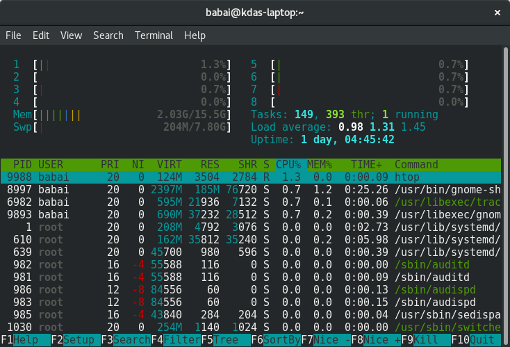

Processes in Linux
===================

A process is a program (think about any Linux application) in a running state.
It contains various details, like the memory space the program needs, a process
id, the files opened by the process, etc.

.. index:: ps

How to view all running processes?
-----------------------------------

The following command shows all the processes from your computer.

::

  $ ps aux
  USER       PID %CPU %MEM    VSZ   RSS TTY      STAT START   TIME COMMAND
  root         1  0.0  0.0 215356  4984 ?        Ss   May29   0:28 /usr/lib/systemd/systemd --system --deserialize 19
  root         2  0.0  0.0      0     0 ?        S    May29   0:00 [kthreadd]
  root         4  0.0  0.0      0     0 ?        S<   May29   0:00 [kworker/0:0H]
  root         6  0.0  0.0      0     0 ?        S    May29   0:11 [ksoftirqd/0]
  root         7  0.0  0.0      0     0 ?        S    May29   8:27 [rcu_sched]
  ... long output

You can see that the output also tells you under which user the process is
running, what the actual command being used is, and the percentage of CPU and
memory usage.

The *PID* column shows the process id; you can see that the *systemd* process
has PID 1, which means it is the first process to start in the system.

How to find a particular process?
----------------------------------

Let’s say, I want to know the process id of the Firefox browser in my system.
I can use the following command to find that information.

::

  $ ps aux | grep firefox
  kdas     26752 96.1  9.7 2770724 763436 ?      Sl   16:16   0:35 /usr/lib64/firefox/firefox
  kdas     26919  0.0  0.0 118520   980 pts/3    S+   16:17   0:00 grep --color=auto firefox

Here, we are first running the ps command, and then passing the output of that
to the next command using the | character. In this case, as you see, grep is
that second command. We can find and look for text using the grep tool. We will
learn more about grep in the future.

.. index:: kill

How to kill/stop a particular process?
---------------------------------------

We can kill/stop any process using the *kill* command. We found out, in the last
example, that the id of the Firefox process in my computer is 26752, we can use
that id to kill it.

::

  $ kill 26752

If there is no error message, you’ll find that Firefox has disappeared.

.. index:: lsof

Finding out list of open files
-------------------------------

**lsof** command will show list of all open files. The man page has more details
about the different command line options available.

.. index:: signal

Signals
--------

Signals are a limited way to communicate to a process. You can think about them
as notifications to a process, and depending on the signal handler in the code,
the process does something with that signal. The *kill* command actually sends a
signal to the given process id, the default signal is *TERM*, which says to
terminate the process. To directly/forcibly kill a process, you can send the
*KILL* signal.

::

  $ kill -9 26752

Here *9* is number representation of the *KILL* signal. To know more about Linux
signals, read the man page.

::

  $ man 7 signal

**kill** command also has a *-l* flag, which prints all of the signal names, and
numbers on the screen.

::

  $ kill -l
  1) SIGHUP	 2) SIGINT	 3) SIGQUIT	 4) SIGILL	 5) SIGTRAP
  6) SIGABRT	 7) SIGBUS	 8) SIGFPE	 9) SIGKILL	10) SIGUSR1
  11) SIGSEGV	12) SIGUSR2	13) SIGPIPE	14) SIGALRM	15) SIGTERM
  16) SIGSTKFLT	17) SIGCHLD	18) SIGCONT	19) SIGSTOP	20) SIGTSTP
  21) SIGTTIN	22) SIGTTOU	23) SIGURG	24) SIGXCPU	25) SIGXFSZ
  26) SIGVTALRM	27) SIGPROF	28) SIGWINCH	29) SIGIO	30) SIGPWR
  31) SIGSYS	34) SIGRTMIN	35) SIGRTMIN+1	36) SIGRTMIN+2	37) SIGRTMIN+3
  38) SIGRTMIN+4	39) SIGRTMIN+5	40) SIGRTMIN+6	41) SIGRTMIN+7	42) SIGRTMIN+8
  43) SIGRTMIN+9	44) SIGRTMIN+10	45) SIGRTMIN+11	46) SIGRTMIN+12	47) SIGRTMIN+13
  48) SIGRTMIN+14	49) SIGRTMIN+15	50) SIGRTMAX-14	51) SIGRTMAX-13	52) SIGRTMAX-12
  53) SIGRTMAX-11	54) SIGRTMAX-10	55) SIGRTMAX-9	56) SIGRTMAX-8	57) SIGRTMAX-7
  58) SIGRTMAX-6	59) SIGRTMAX-5	60) SIGRTMAX-4	61) SIGRTMAX-3	62) SIGRTMAX-2
  63) SIGRTMAX-1	64) SIGRTMAX

.. index:: top

top command
------------

**top** is a very useful command while using a Linux system. It’s a quick way to
know about all the running processes in the system, and their related status
about CPU and memory usage in general. To get out of top, press the key *q*.

::

  top - 17:37:28 up 24 days, 11:52,  2 users,  load average: 0.57, 0.73, 0.75
  Tasks: 372 total,   2 running, 370 sleeping,   0 stopped,   0 zombie
  %Cpu(s): 11.6 us,  2.6 sy,  0.0 ni, 84.9 id,  0.1 wa,  0.3 hi,  0.5 si,  0.0 st
  KiB Mem :  7858752 total,  1701052 free,  4444136 used,  1713564 buff/cache
  KiB Swap:  3268604 total,  1558396 free,  1710208 used.  2431656 avail Mem

    PID USER      PR  NI    VIRT    RES    SHR S  %CPU %MEM     TIME+ COMMAND
  28300 kdas      20   0 1502016 287340  44396 R  25.0  3.7 290:56.60 chrome
  2668 kdas       9 -11 2067292   9756   7164 S   6.2  0.1 166:06.48 pulseaudio
  15122 kdas      20   0  771844  33104  11352 S   6.2  0.4  39:24.60 gnome-terminal-
  24760 kdas      20   0 1945840 209128  76952 S   6.2  2.7   1:41.15 code
  27526 kdas      20   0  156076   4268   3516 R   6.2  0.1   0:00.01 top
      1 root      20   0  215356   4880   3108 S   0.0  0.1   0:28.25 systemd
      2 root      20   0       0      0      0 S   0.0  0.0   0:00.66 kthreadd
      4 root       0 -20       0      0      0 S   0.0  0.0   0:00.00 kworker/0:0H
      6 root      20   0       0      0      0 S   0.0  0.0   0:11.79 ksoftirqd/0
      7 root      20   0       0      0      0 S   0.0  0.0   8:28.06 rcu_sched
  ... long output

By the way, feel free to press *1* and see if anything changes in the top
command output.

.. index:: load average

Load average
-------------

If you look at the *top* output carefully, you will find load average mentioned.
Actually, there are 3 numbers provided; these are the load averages of the
system in the last one minute, 5 minutes ago, and 15 minutes ago.

::

  load average: 0.57, 0.73, 0.75

In simple words, load average means the average time any process has to wait to
get access to the CPU (or other resources), in idle state the load average is 0.
This information is a quick way to learn about the system,  if the system is
slow to respond, just looking at the load-average, and then the rest of the top
output should be a good starting point.

htop tool
----------

**htop** is a modern version of the top tool. It has many more features,
interactiveness being the biggest amongst them. **htop** does not come by default
in most of the Linux installations, which means you will have to install it
using the system’s package management tool.

These are the ways to install it in Fedora and in Debian/Ubuntu

::

  $ sudo dnf install htop -y

::

  $ sudo apt-get install htop

To know more about htop, please read the man page.

::

  $ man htop

More about Linux processes
---------------------------

You can learn more about Linux processes in the glibc manual. Use the *info*
command to find out more.

::

  $ info libc process

.. index:: proc filesystem

/proc directory
----------------

*/proc* is a special directory in our filesystem. This is a virtual filesystem which contains information about all the running processes, and information about the hardware present in the system. You will find that the files in the virtual filesystem are *0* in size.

Now we’ll learn about a few files inside this directory.

.. index:: cpuinfo

/proc/cpuinfo
--------------

*/proc/cpuinfo* file has information about the CPU in your system.
It includes the model number, and also the various flags available in
that particular CPU model.

.. index:: cmdline

/proc/cmdline
---------------

*/proc/cmdline* file has all the parameters passed to the kernel at the bootup
time. The following is a cloud-based virtual machine.

::

  $ cat /proc/cmdline
  BOOT_IMAGE=/boot/vmlinuz-4.8.6-300.fc25.x86_64 root=UUID=9be70055-35f2-4a57-b120-5a003dfdb504 ro no_timer_check console=tty1 console=ttyS0,115200n8 rhgb quiet console=ttyS1 LANG=en_US.UTF-8 initrd=/boot/initramfs-4.8.6-300.fc25.x86_64.img

.. index:: meminfo

/proc/meminfo
--------------

*/proc/meminfo* contains information related to the memory in the system. You can see the total amount RAM, the available memory and other values there.

::

  $ cat /proc/meminfo
  MemTotal:        4046820 kB
  MemFree:         2960568 kB
  MemAvailable:    3696216 kB
  Buffers:           53756 kB
  Cached:           830052 kB
  SwapCached:            0 kB
  Active:           347216 kB
  Inactive:         575692 kB
  Active(anon):      39388 kB
  Inactive(anon):      196 kB
  Active(file):     307828 kB
  Inactive(file):   575496 kB
  Unevictable:           0 kB
  Mlocked:               0 kB
  SwapTotal:             0 kB
  SwapFree:              0 kB
  Dirty:                 4 kB
  Writeback:             0 kB
  AnonPages:         39120 kB
  Mapped:            42032 kB
  Shmem:               488 kB
  Slab:             141692 kB
  SReclaimable:     114996 kB
  SUnreclaim:        26696 kB
  KernelStack:        1360 kB
  PageTables:         2700 kB
  NFS_Unstable:          0 kB
  Bounce:                0 kB
  WritebackTmp:          0 kB
  CommitLimit:     2023408 kB
  Committed_AS:     127752 kB
  VmallocTotal:   34359738367 kB
  VmallocUsed:           0 kB
  VmallocChunk:          0 kB
  HardwareCorrupted:     0 kB
  AnonHugePages:         0 kB
  ShmemHugePages:        0 kB
  ShmemPmdMapped:        0 kB
  CmaTotal:              0 kB
  CmaFree:               0 kB
  HugePages_Total:       0
  HugePages_Free:        0
  HugePages_Rsvd:        0
  HugePages_Surp:        0
  Hugepagesize:       2048 kB
  DirectMap4k:       61296 kB
  DirectMap2M:     4132864 kB
  DirectMap1G:     2097152 kB

/proc/uptime
-------------

::

  $ cat /proc/uptime
  52820.32 104802.84

The first value in this file shows the number of seconds the system is up. The
second value is the total number of idle seconds for each CPU, so for the modern
systems, this value can be more than the first value.

.. index:: sysctl

/proc/sys/ & sysctl command
----------------------------

This directory is a special one for system administrators. This not only
provides information, but also allows you to quickly change (enable/disable)
different kernel features.

We use the **sysctl**  command to view or edit the values for  */proc/sys/*. If
you want to see all the different settings, use the following command.

::

  $ sudo sysctl -a
  [sudo] password for kdas:
  abi.vsyscall32 = 1
  crypto.fips_enabled = 0
  debug.exception-trace = 1
  debug.kprobes-optimization = 1
  dev.cdrom.autoclose = 1
  dev.cdrom.autoeject = 0
  dev.cdrom.check_media = 0
  dev.cdrom.debug = 0
  dev.cdrom.info = CD-ROM information, Id: cdrom.c 3.20 2003/12/17
  ... long output

Enabling IP forward with sysctl
--------------------------------

To enable IP forwarding to the VM(s), use the following command.

::

  $ sudo sysctl -w net.ipv4.ip_forward=1

To check the current value, use the following command.

::

  $ sysctl net.ipv4.ip_forward

You can see the same value in the */proc/sys/net/ipv4/ip_forward*
file too.

::

  $ cat /proc/sys/net/ipv4/ip_forward
  1

To make the change permanent, write the following in the */etc/sysctl.conf*
file.

::

  net.ipv4.ip_forward = 1

Then, enable the changes using the following command.

::

  $ sudo sysctl -p /etc/sysctl.conf

