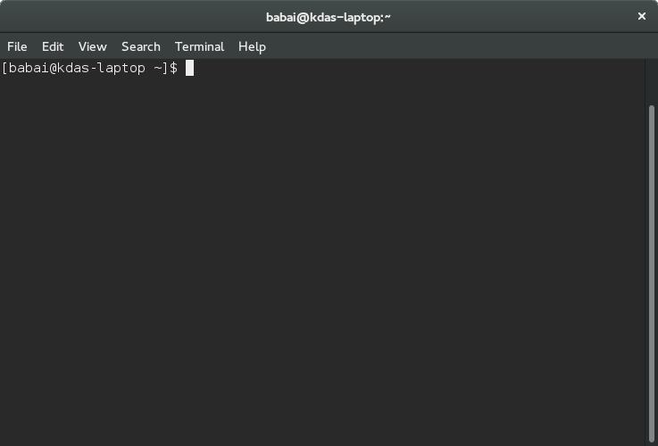

Shell commands
===============

In Linux the shell (or terminal) is the lifeline of the developer, and of any
power user. Things which can be done on the GUI (by clicking on different
buttons), can be done much more efficiently on the terminal by using commands.
Maybe one can not remember all the commands, but with regular usage one can easily
remember the most useful ones.

The following guide will introduce you to a minimal set of basic commands
required to use your Linux computer efficiently.

Terminal emulators
------------------

The above is the screenshot of the Gnome terminal application. As you can see
the command prompt contains the following information::

    [username@hostname directoryname]

In our case the username is *babai*, hostname is *kdas-laptop*, and directory
is mentioned as *~*. This *~* is a special character in our case. It means
the home directory of the user. In our case the home directory path is
*/home/babai/*.

The Gnome terminal is one of many implementations of terminal emulators.
Different Linux environments may come pre-installed with different terminals.

Read the articles on Wikipedia to learn about `computer teriminals
<https://en.wikipedia.org/wiki/Computer_terminal>`_, `terminal emulators
<https://en.wikipedia.org/wiki/Terminal_emulator>`_ and `shell
<https://en.wikipedia.org/wiki/Shell_%28computing%29>`_.

date command
-------------

*date* command prints the current date time.

::

    $ date
    Sun Jun 25 10:13:44 IST 2017

In case you want to know the current date/time in UTC, use the following command.
(I added this in 2018, so please do not get confused at the date.)

::

    $ date -u
    Mon May 21 01:43:47 UTC 2018

If you want to see yesterday's date, or a 10 days ago, you can even do that.

::

        $ date --date="yesterday"
        Fri Apr  9 07:09:01 PM IST 2021

        $ date --date="10 days ago"
        Wed Mar 31 07:09:06 PM IST 2021

cal command
------------

*cal* command is used to display a calendar in your shell, by default it
will display the current month.

::

    $ cal
          June 2017     
    Su Mo Tu We Th Fr Sa
                1  2  3 
    4  5  6  7  8  9 10 
    11 12 13 14 15 16 17 
    18 19 20 21 22 23 24 
    25 26 27 28 29 30    

    $ cal 07 2017
        July 2017     
    Su Mo Tu We Th Fr Sa
                    1 
    2  3  4  5  6  7  8 
    9 10 11 12 13 14 15 
    16 17 18 19 20 21 22 
    23 24 25 26 27 28 29 
    30 31                

whoami command
---------------

*whoami* command will tell you which user account you are using in this system.

::

    $ whoami
    fedora

id command
-----------

*id* prints real user id, and various other details related to the account.

::

    $ id
    uid=1000(fedora) gid=1000(fedora) groups=1000(fedora),4(adm),10(wheel),190(systemd-journal) context=unconfined_u:unconfined_r:unconfined_t:s0-s0:c0.c1023

pwd command
------------

*pwd* command, short for *print working directory*, will help you to find out the absolute path of the current directory. Let us see an example below:
::

    [babai@kdas-laptop ~]$ pwd
    /home/babai

cd command
----------

The next command we will learn is *cd*, short for *change directory*. This command will help you to change your current directory. We will move
to */tmp* directory in our example.::

    [babai@kdas-laptop ~]$ cd /tmp
    [babai@kdas-laptop tmp]$ pwd
    /tmp
    [babai@kdas-laptop tmp]$ cd ~
    [babai@kdas-laptop ~]$ pwd
    /home/babai

Here you can see that first we moved to */tmp* directory, and then we moved
back to the home directory by using
*~* character.

. directory and .. directory
-----------------------------

*.* and *..* has special meaning in the Linux. *.* means the current
directory and *..* means the parent directory. We can use these in various
situations for daily activities.

::

    $ cd ..

The above command changes the current directory to the parent directory.

ls command
----------

We use *ls* command to *list* the files and directories inside any given
directory. If you use *ls* command without any argument, then it will work on
the current directory. We will see few examples of the command below.::

    [babai@kdas-laptop ~]$ ls
    Desktop  Documents  Downloads  Music  Pictures  Public  Templates  Videos
    [babai@kdas-laptop ~]$ ls /tmp/
    cpython           systemd-private-759094c89c594c07a90156139ec4b969-colord.service-hwU1hR
    hogsuspend        systemd-private-759094c89c594c07a90156139ec4b969-rtkit-daemon.service-AwylGa
    hsperfdata_babai  tracker-extract-files.1000
    plugtmp           tracker-extract-files.1002
    [babai@kdas-laptop ~]$ ls /
    bin   cpython  etc   lib    lost+found  mnt  proc  run   srv  sysroot  usr
    boot  dev      home  lib64  media       opt  root  sbin  sys  tmp      var

In the last two commands we provided a path as the argument to the *ls*
command. */* is a special directory, which represents root directory in Linux
filesystem. You will learn more about that in the next chapter.

mkdir command
-------------

We can create new directories using *mkdir* command. For our example we will
create a *code* directory inside our home directory.::

    [babai@kdas-laptop ~]$ ls
    Desktop  Documents  Downloads  Music  Pictures  Public  Templates  Videos
    [babai@kdas-laptop ~]$ mkdir code
    [babai@kdas-laptop ~]$ ls
    code  Desktop  Documents  Downloads  Music  Pictures  Public  Templates  Videos

We can also create nested directories in a single command using the *-p* option.::

    [babai@kdas-laptop ~]$ mkdir -p dir1/dir2/dir3
    [babai@kdas-laptop ~]$ ls dir1/ dir1/dir2/ 
    dir1/:
    dir2

    dir1/dir2/:
    dir3

rm command
----------

*rm* command is used to *remove* a file, or directory. The *-r* option is being
used to remove in a recursive way. With *-f* you *force* the removal, ignoring errors and never prompt.
You can chain the flags, so instead of *rm -r -f* you can as well type *rm -rf*.
But, always double check before you use *rm -rf* command, if you by mistake
give this command in your home directory, or any other important directory,
it will not ask to confirm, but it will delete everything there. So, please be careful
*and read twice before pressing enter key*.

::

    [babai@kdas-laptop ~]$ rm -rf dir1/dir2/dir3
    [babai@kdas-laptop ~]$ ls dir1/ dir1/dir2/ 
    dir1/:
    dir2

    dir1/dir2/:

Copying a file using cp command
-------------------------------

We use the *cp* command to *copy* a file in the Linux shell. To copy a folder with its contents
recursively use the *cp* command with the *-r* flag.  
We use the *cp file_to_copy new_location* format.  
In the example below, we
are copying the *hello.txt* to *hello2.txt*.

::

    $ cp hello.txt hello2.txt
    $ ls -l
    -rw-rw-r--. 1 fedora fedora   75 Jun 25 04:47 hello2.txt
    -rw-rw-r--. 1 fedora fedora   75 Jun 25 04:33 hello.txt

In another example, I will copy the file *passwordauthno.png* from the
Pictures directory in my home directory to the current directory.

::

    $ cp ~/Pictures/passwordauthno.png .

In the following example, I will be copying the *images* directory
(and everything inside it) from the *Downloads* directory under home
to the */tmp/* directory.

::

    $ cp -r ~/Downloads/images /tmp/

Renaming or moving a file
--------------------------

The *mv* command is used to rename or *move* a file or directory. In the
following example, the file *hello.txt* is renamed to *nothello.txt*.

::

    $ mv hello.txt nothello.txt
    $ ls -l
    -rw-rw-r--. 1 fedora fedora 75 Jun 25 04:33 nothello.txt

tree command
-------------

*tree* command prints the directory structure in a nice visual tree design way.

::

    [babai@kdas-laptop ~]$ tree
    .
    ├── code
    ├── Desktop
    ├── dir1
    │   └── dir2
    ├── Documents
    ├── Downloads
    ├── Music
    ├── Pictures
    │   └── terminal1.png
    ├── Public
    ├── Templates
    └── Videos

wc command
-----------

*wc*, short for *word count*, is an useful command which can help us to count newlines, words and bytes
of a file.

::

    $ cat hello.txt
    HI that is a file.
    This is the second line.
    And we also have a third line.
    $ wc -l hello.txt
    3 hello.txt
    $ wc -w hello.txt
    17 hello.txt

The *-l* flag finds the number of lines in a file, *-w* counts the number
of words in the file.

echo command
-------------

*echo* command echoes any given string to the display.

::

    $ echo "Hello"
    Hello

Redirecting the command output
-------------------------------

In Linux shells, we can redirect the command output to a file, or as input to
another command. The pipe operator *|* is the most common way to do so. Using this we can now
count the number of directories in the root (*/*) directory very easily.

::

    $ ls /
    bin  boot  dev  etc  home  lib  lib64  lost+found  media  mnt  opt  proc  root  run  sbin  srv  sys  tmp  usr  var
    $ ls / | wc -w
    20

The **|** is known as pipe. To know more about this, watch `this
video <https://www.youtube.com/watch?v=bKzonnwoR2I>`_.

Using > to redirect output to a file
------------------------------------

We can use *>* to redirect the output of one command to a file, if the file
exists this will remove the old content and only keep the input. We can use
*>>* to append to a file, means it will keep all the old content, and
it will add the new input to the end of the file.

::

    $ ls / > details.txt
    $ cat details.txt 
    bin
    boot
    dev
    etc
    home
    lib
    lib64
    lost+found
    media
    mnt
    opt
    proc
    root
    run
    sbin
    srv
    sys
    tmp
    usr
    var
    $ ls /usr/ > details.txt 
    $ cat details.txt 
    bin
    games
    include
    lib
    lib64
    libexec
    local
    sbin
    share
    src
    tmp
    $ ls -l /tmp/ >> details.txt 
    $ cat details.txt 
    bin
    games
    include
    lib
    lib64
    libexec
    local
    sbin
    share
    src
    tmp
    total 776
    -rwxrwxr-x. 1 fedora fedora     34 Jun 24 07:56 helol.py
    -rw-------. 1 fedora fedora 784756 Jun 23 10:49 tmp3lDEho

Moving around in the command line
----------------------------------

There are key shortcuts available in Bash which will help you to move around faster.
They are by the way very similar to the standard *emacs* keybindings, a number of key
combinations that you will discover in many places and therefore are very handy to memorize
and internalize.
The following table is a good starting point.

+-----------------+------------------------------------------------+
| Key combination | Action                                         |
+=================+================================================+
| Ctrl + A        | Move to the beginning of the line              |
+-----------------+------------------------------------------------+
| Ctrl + E        | Move to the end of the line                    |
+-----------------+------------------------------------------------+
| Alt + B         | Move to the previous word                      |
+-----------------+------------------------------------------------+
| Alt + F         | Move to the next word                          |
+-----------------+------------------------------------------------+
| Ctrl + U        | Cuts  to the beginning of the line             |
+-----------------+------------------------------------------------+
| Ctrl + K        | Cuts  to the end of the line                   |
+-----------------+------------------------------------------------+
| Ctrl + W        | Cuts  the previous word                        |
+-----------------+------------------------------------------------+
| Ctrl + P        | Browse previously entered commands             |
+-----------------+------------------------------------------------+
| Ctrl + R        | Reverse search for previously entered commands |
+-----------------+------------------------------------------------+
| Ctrl + Y        | Pastes the text in buffer                      |
+-----------------+------------------------------------------------+

man pages
----------

*man* shows the system's manual pages. This is the command we use to
view the help document (manual page) for any command. The man pages are
organized based on *sections*, and if the same command is found in many
different sections, only the first one is shown.

The general syntax is *man section command*. Example **man 7 signal**.

You can know about different sections below. Press *q* to quit the program.

::

       1   Executable programs or shell commands
       2   System calls (functions provided by the kernel)
       3   Library calls (functions within program libraries)
       4   Special files (usually found in /dev)
       5   File formats and conventions eg /etc/passwd
       6   Games
       7   Miscellaneous (including macro packages and conventions), e.g. man(7), groff(7)
       8   System administration commands (usually only for root)
       9   Kernel routines [Non standard]

Counting files in a directory
------------------------------

Normally `ls` commands shows all the files and directories in multiple column.
But if you pipe the output to any another command, then it prints one name in a
line. We can combanine that with `wc -l` to count the number of files in a
directory.

::

        ls | wc -l
        73

Editing longer commands
------------------------

If you are typing a long command or something multi-line, then you can type
`Ctrl-x-e`, press Control button, and then `x` and then `e` key. This will open
up a temporary editor using the `$EDITOR`.
