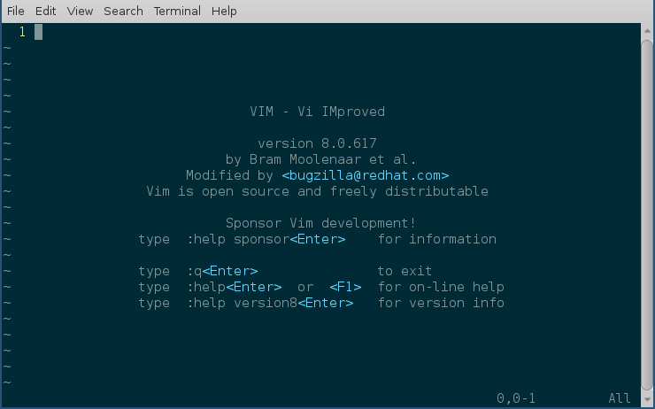
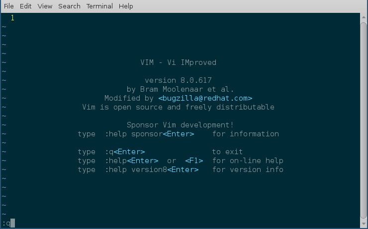
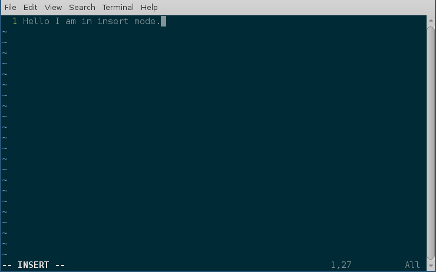

Useful commands
================

In this chapter, we will learn about a few more commands which we may have to
use in daily life.

Creating soft link to a file
-----------------------------

Soft link or symbolic links are a special kind of file, which
actually point to some other file using either related or absolute
paths. We can create soft links using **ln -s** command.

::

    $ ln -s /etc/hostname name
    $ ls -l
    total 12
    -rw-rw-r--. 1 fedora fedora   13 Jun 23 11:14 hello.txt
    lrwxrwxrwx. 1 fedora fedora   13 Jun 23 12:32 name -> /etc/hostname
    $ cat name
    kushal-test.novalocal

In the above example, we created a soft link called *name* to the
*/etc/hostname* file. You can see details about the soft link
files by using the **ls -l** command. You can create links to any
directory in the same way.

If you remove the original file the soft link is pointing to, then the soft link
will become useless, because it’ll point to a file that does not exist. Soft
links can also point to file which is in a different file system.

Creating hard links
--------------------

::

    $ echo "Hello World!" > hello.txt
    $ ln hello.txt bye.txt
    $ ls -l
    total 16
    -rw-rw-r--. 2 fedora fedora   13 Jun 23 11:14 bye.txt
    -rw-rw-r--. 2 fedora fedora   13 Jun 23 11:14 hello.txt
    lrwxrwxrwx. 1 fedora fedora   13 Jun 23 12:32 name -> /etc/hostname
    $ cat hello.txt
    Hello World!
    $ cat bye.txt
    Hello World!
    $ echo "1234" > hello.txt
    $ cat bye.txt
    1234
    $ cat hello.txt
    1234
    $ rm hello.txt
    $ cat bye.txt
    1234
    $ ls -l
    total 12
    -rw-rw-r--. 1 fedora fedora    5 Jun 23 12:39 bye.txt
    lrwxrwxrwx. 1 fedora fedora   13 Jun 23 12:32 name -> /etc/hostname

If you look carefully, at the above example, we’ve created a hard link
using the **ln** command. When we made a change to the original
*hello.txt* file, that is also reflected in the *bye.txt* file.

But, because *bye.txt* is a hard link, even if I delete the
*hello.txt*, the hard link still exists, and also has the original
content.

.. index:: tar

Extracting a tar file
----------------------

**tar** is a tool to create and extract archive files. Many times we will have
to download and then extract tar files in our regular day to day work.

::

    $ tar -xzvf files.tar.gz
    hello.c
    bye.txt

*files.tar.gz* file is compressed with gzip, if the file name ends
*with .tar.bz2*, then it is compressed with bzip2.

::

    $ tar -xjvf files.tar.bz2
    hello.c
    bye.txt

Creating a tar file
----------------------

We can use the same **tar** command to create a tar file.

::

    $ tar -czvf files.tar.gz hello.c bye.txt
    hello.c
    bye.txt
    $ ls
    bye.txt  files.tar.gz  hello.c

.. index:: vim

Vim editor
-----------

Text editors are tools to edit files. This could be a configuration
file, or source code, or an email, or any other kind of text file.
Which editor to use, is generally a personal choice, and a lot of good
energy has been wasted in the telling of which one, is the one, true best editor. In
this book we will just learn about **Vim** editor. It’s also known as
*vi improved* editor. In the Fedora Linux distribution, the *vi*
command is actually an alias to **vim** itself.

If we just type vim, and press enter, we will see the following
screen.

:q to exit vim
---------------

Press Escape and then type *:q* to exit vim.

Open a new file or edit an existing file
-----------------------------------------

*vim filename* is the command to open an existing file. If the file does not exist,
it will open a new, empty file for editing.

Different modes of vim
-----------------------

Vim editor starts off in command mode. Every time you open a file,
this is the default mode of the editor. You can press the *Escape* key
in any other mode to come back to command mode.

You press *i* to go into insert mode; we edit documents in the
insert mode. If you press *Escape*, you will return to
command mode.

:w to save a file
------------------

In command mode, typing *:w* saves a file.
If you want to save and quit the editor, then type either *:wq* or *:x*.

:q! to quit without saving
--------------------------

Typing *:q!*, when you are in command mode, will allow us quit without saving
the current file.

Vim is a powerful editor, and we learned only a few, really basic steps
in it. It will take a complete book, to explain different features of
vim. But, the steps above are sufficient for our book’s scope.

One major thing to remember about any text file, is keeping the
newline character as the last line of the file. Because that is how the
`POSIX <https://en.wikipedia.org/wiki/POSIX>`_ standard
`defines <http://pubs.opengroup.org/onlinepubs/9699919799/basedefs/V1_chap03.html#tag_03_206>`_
a line.

.. index:: su

Becoming root user
-------------------

*root* is the superuser. root has the power to make changes in various parts of
a Linux system. That also means if you make any dangerous change (say deleting
your user account) as root (by mistake), that can easily cause real damage.

The general rule is, when you need superuser power, use the **sudo** command to
get work done, and use your normal user account for everything else. The **su -**
command will helps you become the *root* user; use this *extremely* carefully.

::

    $ su -
    Password:
    #

Notice how the command prompt changed to *#* from *$*, *#* shows that
you are using the *root* — another visible indication to think
about every command you give as *root*. Press *Ctrl+d* to log
out of the *root* account. (Or any account, for that matter.)

.. index:: sudo

Using sudo command
-------------------

Add the **sudo** command in front of any other command to execute them as
*root*. For example:

::

    $ less /var/log/secure
    /var/log/secure: Permission denied
    $ sudo less /var/log/secure
    [sudo] password for fedora:
    ... long output

!! trick
---------

There are times when you forgot to type `sudo` in the front of the command, you can use `!!` along
with `sudo` to type that in faster.

::

    $ less /var/log/secure
    /var/log/secure: Permission denied
    $ sudo !!
    [sudo] password for fedora:
    ... long output

To know more about the ! based bash tricks, read `this blog post from Red Hat <https://www.redhat.com/sysadmin/bash-bang-commands>`_.

.. index:: Environment variable

Environment variables
-----------------------

Environment variables are a way to pass data on to applications. We can set
values of different variables, which any application can then access. There are
various variables which decide how the shell will behave. To see all the
variables, use the **printenv** command.

::

    $ printenv
    ... long output

You can execute the same command once as normal user, and once as
*root*, and then check for the differences between the output.
You will mostly see they are same, with some (or more) unique ones.
That’s because, variables are user specific.

.. index:: export

Setting up environment variable values
---------------------------------------

We can use the **export** command to create a new environment variable
or change an existing one.
We use the **echo** command to
print a particular environment variable’s value.

::

    $ export NAME="Kushal Das"
    $ echo $NAME
    Kushal Das
    $ export NAME="Babai Das"
    $ echo $NAME
    Babai Das

In our example we first created a new variable called *name*, and
then we changed the value of the variable.

.. index:: locate

locate command
---------------

**locate** is a very useful tool to find files in the system. It’s
part of the **mlocate** package. For example, the following command will
search all the files with firewalld in the name.

::

    $ locate firewalld
    /etc/firewalld
    /etc/sysconfig/firewalld
    /etc/systemd/system/basic.target.wants/firewalld.service
    /home/kdas/.local/share/Zeal/Zeal/docsets/Ansible.docset/Contents/Resources/Documents/docs.ansible.com/ansible/firewalld_module.html
    /home/kdas/Downloads/ansible-devel/lib/ansible/modules/system/firewalld.py
    /home/kdas/Downloads/ansible-fail-on-github-zipfile/lib/ansible/modules/system/firewalld.py
    /home/kdas/code/git/ansible/lib/ansible/modules/system/firewalld.py
    ... long output

You can update the search database by using **updatedb** command as
root.

.. index:: updatedb

::

    $ sudo updatedb

This may take some time as it will index all the files in your
computer.

.. index:: timezones

Finding date/time in different timezones
-----------------------------------------

The */usr/share/zoneinfo* directory contains all the different timezone
files. We can use these file names to get current date/time in any timezone. For
example, the following command will show the current date/time in
*US/Pacific* timezone.

::

    $ TZ=US/Pacific date
    Sun May 20 18:45:54 PDT 2018

Bash history
------------

Using **history** command you can check for any command you previously used in the shell,
this output will not show you the commands from the current running shells. Only after
you exit your shell, those commands will be written into `~/.bash_history` file, and history
command tells us the details from there.

The environment variable **HISTFILESIZE** determines the number of commands stored in the file.
By default, the history command does not show timestamps. You can have another environment variable
to set the timestamp of every command. All commands from before setting the timestamp will show the same
time for execution.

::

    echo 'export HISTTIMEFORMAT="%d/%m/%y %T "' >> ~/.bashrc
    source ~/.bashrc
    ...
    ...
    history

Sort files by size
-------------------

You can use **-S** or **--sort=size** option to the **ls** command.

::

    ls -lSh
    total 176K
    -rw-r--r-- 1 kdas kdas  14K Aug 27  2018 networking.rst
    -rw-r--r-- 1 kdas kdas  13K May 21  2018 services.rst
    -rw-r--r-- 1 kdas kdas  13K Aug 30  2019 startingcommands.rst
    -rw-r--r-- 1 kdas kdas  13K Jan 27  2019 processes.rst
    -rw-r--r-- 1 kdas kdas  12K Sep 20 21:35 firewall.rst
    ...
    ...

You can reverse the sorting with passing **-r** option.
