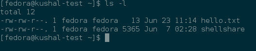

## Users and Groups

In this chapter we’ll learn about user and group management on your system, and also about basic access control.

In Linux everything is associated to an user and a group.  
Based on these values, the system figures out, who can access what part of the system.  
That includes files, directories, network ports etc.

### Finding the owner of file

We use the *ls -l* command to find the owner, and group of a file or directory.



In the above example, fedora is the name of the owner and group both. The first value talks about who can access this file (we will learn about this in a while.)

### /etc/passwd file

*/etc/passwd* contains all the users available in the system. This is a plain text file (this means you can view the information by using *cat* command.)

```
$ cat /etc/passwd
root:x:0:0:root:/root:/bin/bash
bin:x:1:1:bin:/bin:/sbin/nologin
daemon:x:2:2:daemon:/sbin:/sbin/nologin
adm:x:3:4:adm:/var/adm:/sbin/nologin
lp:x:4:7:lp:/var/spool/lpd:/sbin/nologin
sync:x:5:0:sync:/sbin:/bin/sync
shutdown:x:6:0:shutdown:/sbin:/sbin/shutdown
halt:x:7:0:halt:/sbin:/sbin/halt
mail:x:8:12:mail:/var/spool/mail:/sbin/nologin
operator:x:11:0:operator:/root:/sbin/nologin
games:x:12:100:games:/usr/games:/sbin/nologin
ftp:x:14:50:FTP User:/var/ftp:/sbin/nologin
nobody:x:99:99:Nobody:/:/sbin/nologin
systemd-timesync:x:999:998:systemd Time Synchronization:/:/sbin/nologin
systemd-network:x:192:192:systemd Network Management:/:/sbin/nologin
systemd-resolve:x:193:193:systemd Resolver:/:/sbin/nologin
dbus:x:81:81:System message bus:/:/sbin/nologin
sshd:x:74:74:Privilege-separated SSH:/var/empty/sshd:/sbin/nologin
chrony:x:998:995::/var/lib/chrony:/sbin/nologin
systemd-coredump:x:994:994:systemd Core Dumper:/:/sbin/nologin
fedora:x:1000:1000:Fedora:/home/fedora:/bin/bash
polkitd:x:993:993:User for polkitd:/:/sbin/nologin
tss:x:59:59:Account used by the trousers package to sandbox the tcsd daemon:/dev/null:/sbin/nologin
```

Each line has seven entries separated by *:*. 

```
username:password:uid:gid:gecos:/home/dirname:shell

|---------------|---------------------------------|
|FIELD          | MEANING                         |
|---------------|---------------------------------|
| username      | the username                    |
|---------------|---------------------------------|
| password      | the password of the user        |
|---------------|---------------------------------|
| uid           | Numeric user id                 |
|---------------|---------------------------------|
| gid           | Numeric group id of user        |
|---------------|---------------------------------|
| gecos         | arbitary field                  |
|---------------|---------------------------------|
| /home/dirname | Home directory of the user      |
|---------------|---------------------------------|
| shell         | Which shell to use for the user |
|---------------|---------------------------------|
```

You’ll see accounts with */sbin/nologin* as their shell.  
These are generally accounts for various services, which are not supposed to be used by a normal human user; (which is why, no shell is needed.)

The actual user passwords are stored in an encrypted form in  */etc/shadow* file, with only the
root user having access to this file.

```
$ ls -l /etc/shadow
----------. 1 root root 2213 Jun 22 15:20 /etc/shadow
```

### Details about groups

Group details are stored inside the */etc/group* file.  
Each user has one primary group, and zero or more supplementary groups.

### wheel group

If your user is part of the *wheel* group, then it has sudo access. If you remember the Fedora Installer, it actually gives you the option to mark a new user to be part of the wheel group during installation.

```eval_rst
.. index:: useradd
```
### Adding a new user

The *useradd* command adds a new user to the system.  
As you can well guess, this command has to execute as root, otherwise anyone can add random user accounts in the system. The following command adds a new user *babai* to the system.

```
$ sudo useradd babai
```

In Fedora, the initial user you create gets the uid 1000.

```eval_rst
.. index:: passwd
```
### Changing user passwords

*passwd* helps to change any user password.

```
$ sudo passwd babai
Changing password for user babai.
New password: 
Retype new password: 
passwd: all authentication tokens updated successfully.
```

```eval_rst
.. index:: usermod
```
### Modifying existing user details

The *usermod* command can help to modify an existing user.
You can use the same command to lock user account in the system.

```
$ sudo usermod -L babai
$ su - babai
Password: 
su: Authentication failure 
$ sudo usermod -U babai
```

The last command in the above example unlocks the user account.


```eval_rst
.. index:: userdel
```

### Deleting a user

We use the *userdel* command to delete a user from the system.


